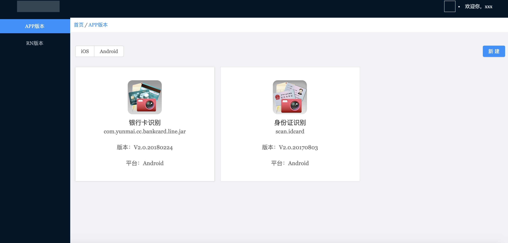

***简介***

> 版本管理后台简易版本；只是简单实现了apk、ipa、rn的bundle文件zip的上传管理；登录没做、分页没做、鉴权没做、缓存没做…[逃]；
包括解析app信息、历史版本展示、文件sha1值读取等

***效果预览***


***开发环境***

java1.7及以上

mysql 8.x

***相关框架***

spring boot 2.x

mybatis

node 9.x 及以上

react 

typescript

umi

***相关***

[管理平台前端项目](https://github.com/lhlhlh111000/app-manager)

[PRD](./prd/start.html)

***后端服务启动***

* clone当前项目
* 在mysql中新建tq_update数据库
* 配置application.properties文件中数据库链接配置
* 启动VersionApplication

***管理平台启动***

* clone前端项目
* npm install 
* npm start

> ps: 项目前后分离，如果要配置接口请求映射地址；编辑.umirc.ts文件中的proxy模块
如下
```$xslt
proxy: {
    "/version/manager": {
      "target": "http://localhost:8099",
      "changeOrigin": true,
    },
    "/rn/manager": {
      "target": "http://localhost:8099",
      "changeOrigin": true,
    }
  }
```